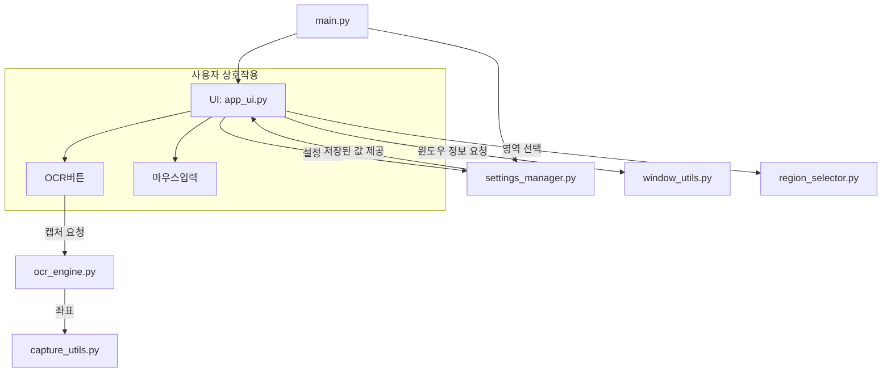

# 🧰 Idle-Tool Python 앱 (proj-python)

Python으로 제작된 OCR 기반 자동화 툴입니다. 사용자가 지정한 영역에서 문자를 인식하고, 키보드 또는 마우스 자동화를 수행할 수 있는 간단한 GUI 앱입니다.

---

## 📂 폴더 구조

```
proj-python/
├── core/
│   ├── capture_utils.py        # 화면 캡처 유틸리티
│   ├── ocr_engine.py           # OCR 처리 기능
│   ├── region_selector.py      # 영역 선택 도구
│   ├── settings_manager.py     # 사용자 설정 저장/불러오기
│   └── window_utils.py         # 윈도우 관련 기능 (창 식별 등)
│
├── ui/
│   └── app_ui.py               # 전체 GUI 구성 및 이벤트 처리
│
├── config.py                   # 전역 설정 상수 정의
├── main.py                     # 앱 진입점
└── requirements.txt            # 필요 패키지 목록 (예상)
```


---

## ⚙️ 주요 파일 및 역할

### 🔹 `main.py`

- 애플리케이션의 진입점
- 설정 매니저 로딩 → GUI 앱 초기화 및 실행

### 🔹 `config.py`

- 기본 설정 상수 정의
  - `DEFAULT_TESSERACT_PATH`: Tesseract OCR 실행 경로
  - `SETTINGS_FILE`: 사용자 설정 저장 경로

---

## 📁 `core/`

### 🔸 `capture_utils.py`

- 화면 일부 또는 전체를 캡처하는 기능 제공
- 이미지 데이터를 PIL 포맷으로 반환하여 OCR이나 UI 표시 등에 활용

### 🔸 `ocr_engine.py`

- 특정 화면 영역을 캡처해 OCR 수행 (`pytesseract` 사용)
- 주요 함수: `read_text_from_screen_region()`

### 🔸 `region_selector.py`

- 마우스로 화면 영역을 지정할 수 있도록 도와주는 도구
- 사각형 드래그로 영역을 시각적으로 설정
- 사용자 선택 영역을 캡처 유틸과 연계

### 🔸 `settings_manager.py`

- 사용자 설정을 JSON 파일로 저장/불러오기
- OCR 좌표, 텍스트, 단축키 등 정보 유지

### 🔸 `window_utils.py`

- 현재 활성화된 윈도우의 제목/위치 정보 획득
- 창 이름 검색, 포커스 지정, 특정 앱 식별 등에 사용

---

## 📁 `ui/`

### 🔸 `app_ui.py`

- Tkinter 기반 GUI 구성
- 입력 필드, OCR 버튼, 키보드/마우스 제어 버튼 등 포함
- 설정값 표시 및 동적 반영

---

## 🔁 모듈 흐름 요약

### 애플리케이션 동작 순서

1. `main.py`에서 설정을 로드하고 UI를 실행
2. `ui/app_ui.py`에서 GUI가 로드됨
3. 사용자가 OCR 버튼 클릭 시 → `core/ocr_engine.py`로 캡처 요청
4. 화면에서 영역을 선택하는 경우 → `core/region_selector.py` 활용
5. 필요한 경우 `core/capture_utils.py`, `window_utils.py`와 상호작용
6. 최종 텍스트는 UI에 표시되거나 키보드 입력으로 전송됨

---

## 📊 전체 시스템 구조 다이어그램



---

## 🧪 필요 라이브러리 (예상)

```txt
pytesseract
Pillow
keyboard
pyautogui
opencv-python
tkinter
```

---

## 🚀 실행 방법

1. `Tesseract OCR` 설치 (예: C:\Program Files\Tesseract-OCR)
2. `pip install -r requirements.txt`
3. `python main.py`

---

## 📌 향후 개선 아이디어

- OCR 정확도 개선 (후처리 적용)
- 다양한 단축키 매핑 지원
- 윈도우 프로세스 인식 기능 추가
- 로그 기록 및 디버그 창
- 다중 모니터 지원 및 DPI 대응

---

## 📁 관련 경로

- GitHub 위치: [Idle-Tool/proj-python](https://github.com/money-netlify/moneyweb/tree/main/public/repos/Idle-Tool/proj-python)

> 문서 자동화 또는 각 모듈 테스트 코드는 별도 폴더로 분리해 추가할 수 있습니다.

